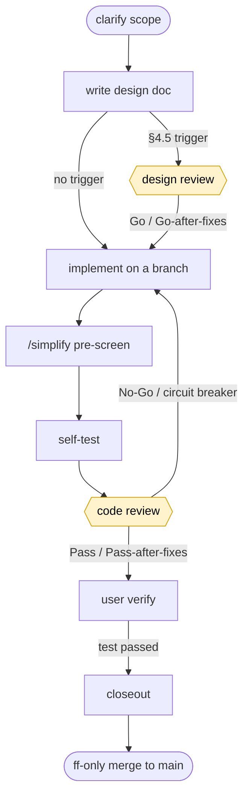

# ccsop

[English](README.md) · [简体中文](README.zh-CN.md) · **Deutsch**

> **Claude Code SOP-Framework** – ein installierbares Claude-Code-Plugin, das einen
> dokumentengesteuerten Auslieferungsworkflow bündelt, damit jedes Repository ihn in einem Schritt übernehmen kann.

ccsop bündelt sieben an einem realen Projekt verfeinerte Bausteine in einem einzigen Plugin:

1. eine **Auslieferungs-SOP** (Vertrag zuerst, kleine Schritte, erst nach Abnahme erledigt, Dokumente als Haltepunkt);
2. ein **Zusammenarbeitsprotokoll** (Treiber + austauschbarer Reviewer; Review-Rahmen 9.A–9.E für design/code/fix);
3. eine **austauschbare Review-MCP-Bridge** – `codex` | `claude` | `manual`;
4. **abgestufte Subagenten** (`verify-runner` / `doc-sync` / `deploy-runner`; mechanische Aufgaben nutzen ein günstigeres Modell);
5. **Skills** (`/handoff` als Startzusammenfassung, `project-sop` als Ausführungskarte);
6. **Dokumentgerüste** (`docs/{records,methodology,plans,design,runbooks,references}` + Aufgabenvorlagen);
7. eine explizite **Modell-Tier-Strategie**.

Installiere das Plugin, führe `/ccsop:sop-init` aus, wähle einen Review-Provider und liefere unter diesem Workflow aus.

## Schnellstart

```text
1. ccsop installieren        → /plugin marketplace add Gnayj/claude-code-sop ; /plugin install ccsop@gnayj
2. neu laden + initialisieren → docs/ + .codex-review/config.toml + .ccsop/manifest.json anlegen
                                (Projektname, Sprache, Review- und Übersetzungsanbieter wählen)
3. Anbieter konfigurieren    → codex: erreichbare Codex CLI (Konfigurationspfad/Paket/PATH) + aktive Anmeldung
                                claude: aktive Claude-CLI-Anmeldung oder ANTHROPIC_API_KEY
                                manual: keine weitere Konfiguration
4. ersten Entwurf schreiben  → docs/design/<module>/<id>-design.md (aus _template-design.txt)
5. Designreview (bei §4.5)   → codex_design_review → Go / Go-after-fixes
6. auf einem Branch umsetzen → ein Teilpunkt; /simplify-Vorprüfung; Selbsttest
7. Codereview                → codex_code_review → Pass / Pass-after-fixes
8. durch Benutzer prüfen     → Prüfbefehl ausführen und „test passed“ antworten
9. abschließen               → thematisch einzelner Commit + Handoff + code-home: ;
                                Fast-Forward-Merge nach den vier Bestätigungspunkten
```

Rufen Sie zu Beginn einer Sitzung `/handoff` auf. Sie erhalten eine kompakte Statuszusammenfassung,
ohne dafür die gesamte Projektdokumentation neu lesen zu müssen.

## Installation, Upgrade und Erstausführung

### Wo soll es installiert werden?

Der unterstützte Installationsweg für aktuelle ccsop-Versionen ist der
**Claude-Code-Plugin-Marktplatz**. Eine Plugin-Installation versorgt beide Hosts:

- Claude Code lädt die Plugin-Befehle und den MCP-Server `ccsop-review`.
- `/ccsop:sop-init` und `/ccsop:sop-update` materialisieren die Projektdateien.
  `/ccsop:sop-init` legt zusätzlich fünf Repository-lokale Codex-Skills unter `.agents/skills/`
  an, wenn Codex am gewählten Ablauf beteiligt ist oder das Gerüst ausdrücklich angefordert
  wurde; zuvor muss das Codex-Host-/Migrationstor bestanden sein. `/ccsop:sop-update` pflegt oder
  migriert diese Skills bei einem Codex-Ablauf, einem Legacy-Baum oder einem bereits vorhandenen
  kanonischen Baum. Ein fehlender Baum wird durch die letzte Bedingung allein nie neu erzeugt.
- Die Codex CLI übernimmt dieses Projektwissen in einer neuen Sitzung. Aktuelle Versionen werden
  nicht als universelles `.codex-plugin` ausgeliefert; installieren Sie daher keine zweite Kopie
  mit `codex plugin add`.

Veröffentlichte Installationen enthalten die Review-Bridge als **vorgefertigtes, eigenständiges
JavaScript-Bundle**. Es ist kein TypeScript-Build nötig; wenn bereits eine kompatible und
authentifizierte Codex CLI verfügbar ist, entfällt auch `npm install`. Der Einrichtungs- oder
Aktualisierungsbefehl bietet den Paket-Fallback nur an, wenn keine Codex-Binärdatei gefunden wird.
Node.js bleibt zum Ausführen des gebündelten MCP-Servers erforderlich.

### Neuinstallation

Im Claude-Code:

```text
/plugin marketplace add Gnayj/claude-code-sop
/plugin install ccsop@gnayj
/reload-plugins
/ccsop:sop-init
/reload-plugins
```

Das erste Neuladen aktiviert den neu installierten Plugin-Befehl. Danach legt
`/ccsop:sop-init` `docs/`, `.codex-review/config.toml`, `.ccsop/manifest.json` sowie alle vier
Review-Prompt-Seeds an. Repository-lokale Codex-Skills werden nur für einen Ablauf mit Codex oder
auf ausdrückliche Anforderung hinzugefügt, nachdem das Host-/Migrationstor bestanden wurde. Der
Befehl ergänzt fehlende Dateien, überspringt vorhandene Dateien, erzeugt keinen Commit und
überschreibt ohne `--force` nichts. Nach dem abschließenden Neuladen kann der Plugin-MCP-Server die
neue Projektkonfiguration lesen.

Jedes ccsop-Release besitzt eine Plugin-Version und einen unveränderlichen Git-Tag; der Marktplatz
verweist auf den aktuellen Release-Commit.

### Aktualisieren Sie eine vorhandene Installation

Führen Sie für eine Installation im Benutzerbereich Folgendes über die Shell aus:

```bash
claude plugin marketplace update gnayj
claude plugin update ccsop@gnayj --scope user
```

Die entsprechenden Befehle in Claude Code sind:

```text
/plugin marketplace update gnayj
/plugin update ccsop@gnayj
/reload-plugins
```

Starten Sie Claude Code neu oder führen Sie `/reload-plugins` aus, **bevor** Sie den aktualisierten
Befehl verwenden. Eine alte Sitzung kann noch auf den verwaisten Cache der vorherigen
Plugin-Version zeigen. Führen Sie anschließend in jedem Repository mit vorhandener
`.ccsop/manifest.json` Folgendes aus:

```text
/ccsop:sop-update
```

`/ccsop:sop-update` aktualisiert ccsop-eigene Dateien und unveränderte generierte Seeds. Dateien
des Verbrauchers und lokal geänderte Inhalte bleiben erhalten; Konflikte werden gemeldet statt
überschrieben. Befolgen Sie alle ausgegebenen Anweisungen zu `/mcp`, Neuverbindung oder Neustart.

Bei einem mit v0.2.13 auf zh-CN initialisierten Repository können
`.codex-review/templates/implement.md.tpl` und dessen Manifesteintrag fehlen. Nach dem Upgrade auf
v0.2.14 ergänzt die übliche Sequenz aus Neuladen/Neustart und `/ccsop:sop-update` beides mit
`new-seed-added`, sofern beides fehlte. Belegt bereits eine nicht verfolgte Datei diesen Pfad,
bewahrt ccsop sie und meldet den Herkunftskonflikt, statt sie zu überschreiben.

Repositorys, die erstmals mit v0.1.0 übernommen wurden, können noch die historischen Manifest-IDs
`review-prompts/<basename>` enthalten. Seit v0.2.15 erkennt `/ccsop:sop-update` ausschließlich das
exakte Paar aus offizieller Legacy-ID und Pfad `.codex-review/templates/<basename>`, normalisiert
es atomar zu `templates/review-prompts/<basename>` und führt danach den üblichen Abgleich der vier
Prompts aus. Unbekannte, unpassende, zurückgezogene, doppelte oder kollidierende Herkunft bleibt
gesperrt. Prüfen und korrigieren Sie in diesem Fall einen offiziellen Eintrag auf die exakte
kanonische ID oder entfernen Sie einen falschen Manifesteintrag und führen Sie den Befehl erneut
aus. Nur `owner` zu ändern oder „keep-local“ zu wählen, beseitigt eine Mehrdeutigkeit im
Namensraum nicht.

### Überprüfen Sie Claude Code und Codex CLI

1. Führen Sie `claude plugin list --json` aus und prüfen Sie, dass `ccsop@gnayj` die erwartete
   veröffentlichte Version meldet.
2. Prüfen Sie im Ziel-Repository `.ccsop/manifest.json` sowie alle vier Dateien
   `.codex-review/templates/{design-review,code-review,fix-review,implement}.md.tpl`.
3. Prüfen Sie den von `/sop-init` oder `/sop-update` gemeldeten Codex-Scaffold-Zweig:
   - Bei `claude+claude` ohne Legacy- oder vorhandenen kanonischen Baum ist das Fehlen von
     `.agents/skills` erwartet. Eine ausdrückliche Scaffold-Anforderung ist eine Funktion des
     ersten `/sop-init`; sobald der kanonische Baum existiert, pflegt `/sop-update` ihn, erzeugt
     einen fehlenden Baum aber nicht neu.
   - Bei einem Ablauf mit Codex, bestandenem Host-Gate und ohne Herkunfts-/Migrationskonflikt
     werden `.agents/skills/{project-sop,handoff,simplify,sop-flow,sop-tier}/SKILL.md` und der
     ccsop-Zeiger in `AGENTS.md` erwartet.
   - Bei fehlgeschlagenem Host-Gate oder ungelöstem Herkunfts-/Migrationskonflikt müssen die
     bisherigen Bytes und der bisherige Zeiger erhalten bleiben. Melden Sie den begrenzten
     Konflikt; behaupten Sie nicht, dass kanonische Skills vorhanden seien.
4. Sind kanonische Skills vorhanden, verwenden Sie Codex CLI `>=0.145.0-alpha.2`, starten Sie in
   diesem Repository eine **neue** Codex-Sitzung und rufen Sie `$handoff` auf.
5. Für automatische Review-/Steuerungswerkzeuge in Codex führen Sie `codex mcp list` aus. Prüfen
   Sie, dass derselbe stdio-Server `ccsop-review` registriert und aktiviert ist und sein
   `--config`-Argument auf `.codex-review/config.toml` dieses Repositorys zeigt. Ohne diese
   projektkorrekte Codex-seitige MCP-Registrierung werden die lokalen Skills weiterhin geladen,
   die modellübergreifende Prüfung muss jedoch manuell weitergereicht werden.

### Von einem Klon laden

So pinnen oder ändern Sie eine Revision, anstatt sie vom Marktplatz zu installieren:

```bash
git clone https://github.com/Gnayj/claude-code-sop /path/to/ccsop
cd /your/repo && claude --plugin-dir /path/to/ccsop
```

**Ein Anbieter wird erst zum Zeitpunkt der Prüfung benötigt.** Das Gerüst (`/sop-init`) benötigt
keinen. Konfigurieren Sie einen, sobald Sie zur Prüfung bereit sind: `codex` (kompatible Codex CLI
mit aktiver Anmeldung), `claude` (aktive Claude-CLI-Anmeldung für das CLI-Backend oder
`ANTHROPIC_API_KEY` für das API-Backend) oder `manual` (keine Abhängigkeit). Plugin-Befehle bleiben
im Namensraum, beispielsweise `/ccsop:sop-init`.

## Auswahl eines Bewertungsanbieters

| Anbieter | Was es ist | Vorteile | Nachteile/Vorbehalt |
|---|---|---|---|
| `codex` (Standard) | Prüfung durch den gebündelten Codex-Anbieter | **modellübergreifende Heterogenität** – ein unabhängiges Modell erkennt blinde Flecken des Fahrermodells; dies ist der verifizierte Pfad | benötigt Node sowie eine kompatible, authentifizierte Codex CLI oder den optionalen Paket-Fallback |
| `claude` | Prüfung über Claude CLI oder Anthropic API | unterstützt ein angemeldetes CLI-Abonnement oder API-basierte Ausführung | **keine modellübergreifende Heterogenität** – eine neue adversarielle Instanz hilft, ist aber nicht gleichwertig; benötigt kompatible authentifizierte CLI oder API-Schlüssel |
| `manual` | erzeugt einen Prompt, in den ein Urteil zurückgegeben wird | keine Abhängigkeiten; menschlicher oder externer Reviewer | zweiphasig (vorbereiten → einreichen); Sie liefern das Urteil |

Zum Wechseln des Anbieters ändern Sie `review.provider` in `.codex-review/config.toml`. Der Wechsel
macht die vorherige Sitzung ungültig; Threads werden nicht anbieterübergreifend wiederverwendet.

## Kollaborationsabläufe (wer entwirft × wer implementiert)

Über die Wahl des Reviewers hinaus können Sie die **Arbeit selbst** zwischen den beiden Modellen
aufteilen (`claude-code-sop-collaboration.md §1.D`). Es gibt vier umschaltbare Abläufe, benannt
`<design_owner>+<implement_owner>`:

| Ablauf | Design | Designreview | Implementierung | Codereview | gesteuert über |
|---|---|---|---|---|---|
| `claude+claude` (Standard) | Claude | Codex | Claude | Codex | Claude Code |
| `claude+codex` | Claude | Codex | Codex | Claude | Claude Code |
| `codex+codex` | Codex | Claude | Codex | Claude | Codex CLI |
| `codex+claude` | Codex | Claude | Claude | Codex | Codex CLI |

- **Reviewer werden abgeleitet, nicht konfiguriert.** Jede Phase wird vom Gegenmodell des jeweiligen
  Owners geprüft. Damit bleibt die modellübergreifende Prüfung in jedem Ablauf erhalten und
  Selbstprüfung ist nicht darstellbar.
- **Gesteuert wird über die CLI des Design-Owners.** In geteilten Abläufen (`claude+codex` /
  `codex+claude`) läuft der Abschnitt Implementierung → Codereview → Fix → testbereit in der CLI
  des Implementierers. Grundlage ist eine verpflichtende Implementierungs-Aufgabenkarte;
  `current.md` und die Karte tragen die Übergabe.
- **`claude+codex`-Bonus – Preside-Modus:** Bei diesem Ablauf kann der CLI-Wechsel vollständig
  entfallen. Mit `[implement] enabled = true` übergibt der Treiber begrenzte Arbeitsaufträge über
  `codex_implement` an einen Codex-Writer. Codex arbeitet in einem isolierten Arbeitsbereich; der
  Server prüft das Ergebnis gegen die `files`-Allowlist der Aufgabenkarte. Jede nicht erlaubte
  Endzustandsänderung führt zur Ablehnung, ohne etwas auszugeben. Zurück kommt ein
  **Patch-Artefakt**, das der Treiber selbst prüft und anwendet
  (`git apply --check` → `git apply`). Das Tool schreibt Ihr Repo nie und nichts wird automatisch angewendet.
- **`codex+claude` – optionaler Vorschlagsmodus:** Unter Linux stellt Schema 2 mit
  `bwrap`/`prlimit` und einer zertifizierten, authentifizierten Claude CLI `claude_implement`
  bereit. Der Adapter verwendet dieselbe Snapshot-/Capture-/Allowlist-Transaktion, erlaubt nur
  Read/Edit/Write und kein Bash, bindet einen Aufgabenkarte-SHA ein, führt dauerhafte
  design/daily-Budgets, beendet Prozessgruppen kontrolliert und validiert serverseitig offline.
  Ausgeliefert wird er mit `enabled=false`; die Ablaufwahl aktiviert ihn nie. Ohne konfigurierte
  Validierung entstehen ehrliche `advisory-only / export-only`-Artefakte, keine anwendbaren Patches.
- **Umschalten** erfolgt über die gemeinsame Steuerungsoberfläche: `/sop-flow` für
  Claude-gesteuerte und `$sop-flow` für Codex-gesteuerte Abläufe. Beide verwenden den
  schema-konformen Writer `ccsop_configure`; der nächste Bridge-Aufruf sieht die Änderung ohne
  Neustart. Eine sitzungsspezifische Anweisung wie „diese Sitzung codex+claude“ bleibt
  schreibgeschützt. Schema 1 behandelt `codex+claude` weiterhin als **manuelle Übergabe**; Schema 2
  meldet die tatsächliche Aktivierungs-, Validierungs- und Anwendungsbereitschaft des
  Claude-Vorschlagsadapters. Jede Änderung erhält ein inhaltsadressiertes Abbild unter
  `<meta.repo_root>/.ccsop/backups/config/<sha256>.toml`. Diese Sicherungen sind vom Betreiber
  verwaltete Wiederherstellungsdaten ohne automatischen Ablauf. Halten Sie `.ccsop/backups/`
  uncommitted und entfernen Sie alte Einträge nur nach der Aufbewahrungsrichtlinie des Repositorys.
- Bei einem Ablauf mit Codex oder auf ausdrückliche Anforderung legt `/sop-init` nach bestandenem
  Host-/Migrationstor fünf Repository-lokale Codex-Skills unter dem kanonischen `.agents/skills/` an:
  `$project-sop`, `$handoff`, `$simplify`, `$sop-flow`, und `$sop-tier`. Dies erfordert
  Codex CLI `>=0.145.0-alpha.2`. `/sop-update` migriert nur eine unveränderte Legacy-Kopie
  `.codex/skills/project-sop` mit belegter Herkunft; geänderte, unbekannte oder abweichende Kopien
  bleiben als Konflikte erhalten. Exakt verifizierte Migrationen lassen sich mit
  `/sop-update --rollback-codex-skills` zurückrollen.

## Workflow auf einen Blick



Die beiden gelben Knoten sind Review-Gates: Der Reviewer arbeitet **schreibgeschützt** ohne
Netzwerk oder Schreibzugriff. Der Treiber setzt das Urteil mechanisch um und bezieht Sie nur bei
einem Circuit Breaker oder `No-Go` ein. Der abschließende Merge durchläuft **vier
Bestätigungspunkte**: Feature-Branch pushen → mergen → main pushen → Remote-Branch löschen. Den
vollständigen Ablauf, Fehlermodi und das Rollback-Playbook beschreibt
`docs/methodology/workflow-overview.md`.

## Ausführungsframework – warum es funktioniert, Best Practices, Vorsichtsmaßnahmen

**Was Sie erhalten.** Einen geschlossenen Kreislauf – *Vertrag → Entwurf → Review →
Implementierung → Review → Test → Abschluss → Merge*. Jeder Schritt wird dokumentiert, sodass die
Arbeit auch nach längerer Pause fortgesetzt werden kann, ohne Entscheidungen neu herzuleiten:

- **Vertrag zuerst, kleine Schritte:** Verhaltensvertrag und Abnahme werden vor dem Code fixiert;
  pro Runde wird genau ein nachweisbarer Teilpunkt umgesetzt und erst nach Abnahme abgeschlossen.
- **Unabhängige, austauschbare Reviews:** Design-, Code- und Fix-Reviews kommen von einem
  unabhängigen Modell. `codex` als Standard schafft modellübergreifende Heterogenität und erkennt
  blinde Flecken des Fahrermodells; `claude` und `manual` werden ebenfalls unterstützt.
- **Dokumente als Haltepunkt:** `current.md`, Aufgabenkarten und `code-home:` halten eine auch Monate
  später wiederherstellbare Spur.
- **Modellstufen:** Ein starkes Modell übernimmt Beurteilungen, günstigere Stufen erledigen
  mechanische Agentenaufgaben (`model-tier-strategy.md`).
- **Autonomieregler** (`[collaboration] autonomy`): Verwenden Sie **`gated`**, um jedes Gate selbst
  zu bestätigen, oder **`full-auto`**. Dann durchläuft der Treiber den gesamten Zyklus und stoppt
  nur bei Entscheidungen, die tatsächlich Ihnen gehören; am Ende steht ein einziger Laufbericht.
- **Ablaufmatrix** (`[collaboration] design_owner / implement_owner`): Design und Implementierung
  lassen sich in vier Abläufen zwischen den Modellen aufteilen. Das Gegenmodell prüft immer;
  gesteuert wird über die CLI des Design-Owners.
- **Consumer-Erweiterungsblöcke:** Bewahren Sie projekteigene Inhalte in von ccsop verwalteten Markdown-Dokumenten auf
  (`<!-- consumer:begin <slug> anchor="<section>" -->` … `<!-- consumer:end <slug> -->`) — `/sop-update`
  rendert um diese Blöcke herum. Framework-Aktualisierungen und Ihre Erweiterungen können so
  nebeneinander bestehen; reine Übersetzungskorrekturen erreichen ebenfalls bereits übersetzte
  Repositorys (`translation_source_sha`).

**Best Practices.**

- Beginnen Sie mit **`gated`** und wechseln Sie bei klar spezifizierten Aufgaben mit maschinell
  prüfbarer Abnahme zu **`full-auto`**.
- Setzen Sie bei stil- oder geschmacksintensiven Aufgaben und großen Serien früh einen
  **Muster-Kontrollpunkt**, bevor Sie die Massenausgabe starten. Full Auto baut diesen Schutz ein,
  damit Fehler nicht effizient skaliert werden.
- Lassen Sie den **Reviewer** technische Abzweigungen entscheiden und reservieren Sie Ihre
  Aufmerksamkeit für Präferenz-, Geschäfts- und Abnahmeentscheidungen.
- Halten Sie `current.md` als einzige Quelle des aktuellen Zustands und rufen Sie zu
  Sitzungsbeginn `/handoff` auf.

**Vorsichtsmaßnahmen.**

- `full-auto` führt **niemals** automatisch destruktive, produktive oder irreversible Aktionen aus,
  überträgt **niemals** privat → öffentlich oder an ein Remote und veröffentlicht oder deployt
  **niemals** automatisch. Solche Schritte werden immer an Sie eskaliert.
- **Selbstverifikation ist nicht Ihre Abnahme** bei subjektiver Qualität oder Verhalten in realer
  Umgebung. Full Auto eskaliert solche Prüfungen und erledigt nur maschinell prüfbare Gates selbst.
- Kann eine erforderliche Prüfung wegen fehlendem Schlüssel, fehlender Berechtigung oder fehlendem
  Tool **nicht ausgeführt werden**, hält Full Auto an, statt einen Erfolg zu behaupten.

Siehe `docs/methodology/claude-code-sop-collaboration.md` §1.A–§1.C für Autonomieregler,
Eskalationsprädikat und Selbstverifikationsgrenze sowie `workflow-overview.md` für den vollständigen
Ablauf.

## Befehle und Fähigkeiten

- `/sop-init` – Assistent zum erstmaligen Anlegen des Gerüsts.
- `/sop-flow` – den aktuellen Claude-gesteuerten Ablauf über `ccsop_configure` anzeigen oder umschalten.
- `/sop-tier` – Reviewer- und Codex-Dispatch-Stufen über `ccsop_configure` anzeigen oder setzen.
- `/sop-update` – ccsop-eigene Dokumentaktualisierungen konfliktfest übernehmen; Ihre
  `records/current.md` wird nie verändert.
- `/sop-lang <lang>` – Dokumente in einer anderen Sprache neu materialisieren; die Übersetzung
  erfolgt einmal, maschinenstabile Oberflächen bleiben unverändert.
- Claude `/handoff` – strukturierter Projektstatus zum Sitzungsstart oder Aufgabenwechsel.
- Codex `$project-sop`, `$handoff`, `$simplify`, `$sop-flow`, `$sop-tier` – kanonische Ausführungs-
  und Steuerungsoberflächen unter `.agents/skills/`.

## Layout

```
ccsop/
├─ .claude-plugin/plugin.json        plugin manifest (commands/agents/skills/mcpServers)
├─ commands/                          /sop-init · /sop-flow · /sop-tier · /sop-update · /sop-lang
├─ agents/                            verify-runner · doc-sync · deploy-runner (sonnet tier)
├─ skills/                            handoff · project-sop
├─ mcp/codex-review/                  the pluggable review bridge (ReviewProvider abstraction)
├─ templates/                         docs-scaffold/ (canonical EN) + config.toml.tpl + review-prompts/
└─ docs/design/ccsop-framework/       the framework's own design doc
```

## Lizenz

[MIT](LICENSE).
