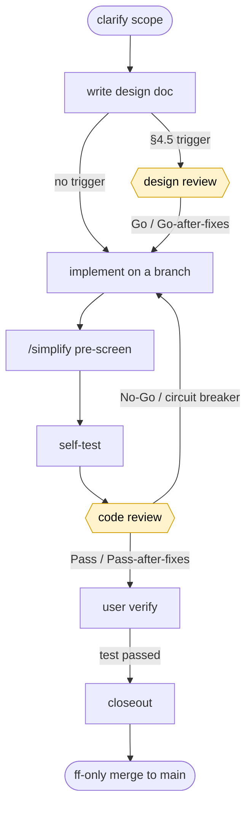

# ccsop

**English** · [简体中文](README.zh-CN.md)

> **Claude Code SOP framework** — an installable Claude Code plugin that packages a
> document-driven delivery workflow so any repository can adopt it in one step.

ccsop bundles seven building blocks refined on a real project into a single plugin:

1. a **delivery SOP** (contract-first, small steps, not-done-until-accepted, docs-as-breakpoint);
2. a **collaboration protocol** (driver + pluggable reviewer; design/code/fix review framework 9.A–9.E);
3. a **pluggable review MCP bridge** — `codex` | `claude` | `manual`;
4. **tiered subagents** (`verify-runner` / `doc-sync` / `deploy-runner`, mechanical = cheaper model);
5. **skills** (`/handoff` startup summary, `project-sop` execution map);
6. **doc scaffolding** (`docs/{records,methodology,plans,design,runbooks,references}` + task templates);
7. an explicit **model-tier strategy**.

Install the plugin, run `/sop-init`, pick a review provider, and start shipping under the workflow.

## Quickstart

```text
1. install ccsop             → /plugin marketplace add Gnayj/claude-code-sop ; /plugin install ccsop@gnayj
2. /sop-init                 → scaffold docs/ + .codex-review/config.toml + .ccsop/manifest.json
                               (asks: project name, language, review provider, translation provider)
3. configure the provider    → codex: install bridge deps (npm install) + Codex login
                               claude: export ANTHROPIC_API_KEY
                               manual: nothing
4. write your first design   → docs/design/<module>/<id>-design.md (from _template-design.txt)
5. design review (if §4.5)   → codex_design_review → Go / Go-after-fixes
6. implement on a branch     → one sub-item; /simplify pre-screen; self-test
7. code review               → codex_code_review → Pass / Pass-after-fixes
8. user verify               → run the verify command, reply "test passed"
9. closeout                  → single-subject commit + handoff + code-home: ; ff-only merge per the 4 confirmation points
```

At session start, invoke `/handoff` for a ~150-line state summary instead of reading everything.

## Installing & first run

ccsop is a Claude Code plugin. Released installs ship the review bridge **prebuilt** (its compiled
`dist/` is committed), so there's no TypeScript build step — you only ever run `npm install` once for
the bridge's runtime dependencies.

**Install from the marketplace (recommended).** Inside Claude Code:
```text
/plugin marketplace add Gnayj/claude-code-sop
/plugin install ccsop@gnayj
```
ccsop is versioned by commit SHA — there's no version number to bump, so `/plugin marketplace update`
always pulls the latest.

**Or load from a clone** (e.g. to pin or hack on a revision):
```bash
git clone https://github.com/Gnayj/claude-code-sop /path/to/ccsop
cd /your/repo && claude --plugin-dir /path/to/ccsop
```

Either way, plugin commands are **namespaced** under the plugin, e.g. `/ccsop:sop-init`.

**First-run order.** The review bridge reads the config that `/sop-init` writes, so run them in this order:
1. `/ccsop:sop-init` — scaffolds `docs/`, `.codex-review/config.toml`, and `.ccsop/manifest.json`,
   and offers to install the bridge's runtime dependencies (`npm install` in `mcp/codex-review/` —
   no build, since `dist/` already ships). It **only adds files** — it skips anything you already
   have, makes no commit, and never overwrites without `--force` — so it's safe to adopt in an existing repo.
2. `/reload-plugins` (or restart) once after `/sop-init`, so the bridge picks up the new config.
   Until the config exists, the `ccsop-review` server stays connected-but-idle and simply tells you
   to run `/sop-init` — no review work happens before setup is complete.

**Providers are needed only at review time.** Scaffolding (`/sop-init`) needs no provider. Configure
one when you're ready to review: `codex` (Codex login), `claude` (`ANTHROPIC_API_KEY` — Console
billing, separate from a Pro/Max plan), or `manual` (nothing). See the table below.

## Choosing a review provider

| Provider | What it is | Pros | Cons / caveat |
|---|---|---|---|
| `codex` (default) | review via the Codex SDK | **cross-model heterogeneity** — an independent model catches blind spots the driver's own model misses; this is the verified path | needs Node + `@openai/codex-sdk` + a Codex login |
| `claude` | review via the Anthropic SDK | no second vendor; runs anywhere with `ANTHROPIC_API_KEY` | **loses cross-model heterogeneity** — a fresh adversarial instance partially compensates but is not equivalent; documented, not equivalent to codex |
| `manual` | write a prompt, paste back a verdict | zero dependencies; human / external reviewer | two-phase (prepare → submit); you supply the verdict |

Switching providers is a one-line `review.provider` change in `.codex-review/config.toml`
(switching invalidates the prior session — no cross-provider thread reuse).

## Collaboration flows (who designs × who implements)

Beyond picking a reviewer, you can split the **work itself** between the two models
(`claude-code-sop-collaboration.md §1.D`). Four switchable flows, named
`<design_owner>+<implement_owner>`:

| flow | design | design review | implement | code review | you drive from |
|---|---|---|---|---|---|
| `claude+claude` (default) | claude | codex | claude | codex | Claude Code |
| `claude+codex` | claude | codex | codex | claude | Claude Code |
| `codex+codex` | codex | claude | codex | claude | Codex CLI |
| `codex+claude` | codex | claude | claude | codex | Codex CLI |

- **Reviewers are derived, not configured** — each stage is reviewed by the counterpart of that
  stage's owner, so cross-model review is preserved in every flow and self-review is
  unrepresentable.
- **You drive from the design owner's CLI.** In split flows (`claude+codex` / `codex+claude`) the
  implement segment (implement → code review → fix → ready-to-test) runs in the implementer's CLI
  against a mandatory implement task card; `current.md` + the card carry the handoff.
- **`claude+codex` bonus — preside mode**: this cell can skip the CLI switch entirely. With
  `[implement] enabled = true` the driver dispatches bounded work orders to a codex writer via
  `codex_implement`: codex works in an isolated scratch, the server validates the result against
  the card's ```files allowlist (any out-of-scope end-state change ⇒ rejected, nothing emitted)
  and returns a **patch artifact** — which the driver reviews and applies itself
  (`git apply --check` → `git apply`). The tool never writes your repo and nothing auto-applies.
- **Switch** via `[collaboration] design_owner / implement_owner` in `.codex-review/config.toml`
  (leave both absent for the default — then `review.provider` governs, exactly the table above), or
  per session by telling the driver ("this one codex+claude"). `/sop-init` asks this as a setup
  question and scaffolds the Codex-side execution map (`.codex/skills/` + an `AGENTS.md` pointer)
  when a flow involves codex.

## Workflow at a glance



The two yellow nodes are reviewer gates: the reviewer runs **read-only** (no network, no write) and
the driver executes the verdict mechanically, only calling you on a circuit breaker or `No-Go`. The
final merge passes **4 confirmation points** (push feature → merge → push main → delete remote). Full
flow, failure modes, and rollback playbook: `docs/methodology/workflow-overview.md`.

## Execution framework — why it works, best practices, cautions

**What you get.** A single closed loop — *contract → design → review → implement → review → test → closeout →
merge* — where every step lands in docs, so work resumes cold and nothing is re-derived. Concretely:

- **Contract-first, small steps**: a behavior contract + acceptance is locked before code; one verifiable
  sub-item per round (not-done-until-accepted).
- **Independent, pluggable review**: design/code/fix review by an independent model — `codex` (default) gives
  cross-model heterogeneity that catches your own model's blind spots; `claude` / `manual` also work.
- **Docs as the breakpoint**: `current.md` + task cards + `code-home:` keep a months-later-recoverable trail.
- **Model tiering**: a strong model for judgment, a cheaper tier for mechanical agents (`model-tier-strategy.md`).
- **Autonomy dial** (`[collaboration] autonomy` in config): run **`gated`** (you confirm each gate) or
  **`full-auto`** — the driver runs the whole loop and only stops to escalate when a decision is genuinely
  yours, ending in a single run report.
- **Flow matrix** (`[collaboration] design_owner / implement_owner`): split design and implementation
  between the two models (4 flows, "Collaboration flows" above) — the counterpart always reviews, and you
  drive from the design owner's CLI.
- **Consumer extension blocks**: keep project-owned content inside ccsop-managed Markdown docs
  (`<!-- consumer:begin <slug> anchor="<section>" -->` … `<!-- consumer:end <slug> -->`) — `/sop-update`
  re-renders around them, so framework updates and your extensions coexist; translation-only fixes now
  also reach translated repos (`translation_source_sha`).

**Best practices.**

- Start **`gated`**; graduate to **`full-auto`** for well-specified work with machine-checkable acceptance.
- For **taste/style-heavy** or **large-batch** work, take an early **sample checkpoint** before mass output —
  full-auto bakes this in, so it can't be "efficiently wrong" at scale.
- Let the **reviewer** arbitrate technical forks; reserve your attention for preference / business / acceptance calls.
- Keep `current.md` the single source of current state; invoke `/handoff` at session start.

**Cautions.**

- `full-auto` **never** auto-does destructive / production / irreversible actions, **never** pushes private →
  public or to any remote, and **never** auto-publishes/deploys — those always escalate to you.
- **Self-verification ≠ your acceptance** for subjective quality or real-environment behavior; full-auto
  escalates those (it self-verifies only machine-checkable gates).
- If a required check **can't run** (missing key / permission / tool), full-auto **stops** rather than claim it passed.

See `docs/methodology/claude-code-sop-collaboration.md` §1.A–§1.C (autonomy dial + escalation predicate +
self-verify boundary) and `workflow-overview.md` for the full flow.

## Commands & skills

- `/sop-init` — first-time scaffold wizard.
- `/sop-update` — pull ccsop-owned doc updates (conflict-safe; never touches your `records/current.md`).
- `/sop-lang <lang>` — re-materialize docs in another language (translate-once, machine-stable surfaces preserved).
- `/handoff` — structured project state for session start / task switch.
- `project-sop` — execution map pointing at the methodology docs.

## Layout

```
ccsop/
├─ .claude-plugin/plugin.json        plugin manifest (commands/agents/skills/mcpServers)
├─ commands/                          /sop-init · /sop-update · /sop-lang
├─ agents/                            verify-runner · doc-sync · deploy-runner (sonnet tier)
├─ skills/                            handoff · project-sop
├─ mcp/codex-review/                  the pluggable review bridge (ReviewProvider abstraction)
├─ templates/                         docs-scaffold/ (canonical EN) + config.toml.tpl + review-prompts/
└─ docs/design/ccsop-framework/       the framework's own design doc
```

## License

[MIT](LICENSE).
