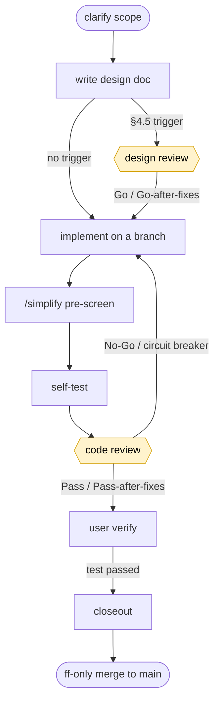

# ccsop

**English** · [简体中文](README.zh-CN.md)

> **Claude Code SOP framework** — an installable Claude Code plugin that packages a
> document-driven delivery workflow so any repository can adopt it in one step.

ccsop bundles seven building blocks refined on a real project into a single plugin:

1. a **delivery SOP** (contract-first, small steps, not-done-until-accepted, docs-as-breakpoint);
2. a **collaboration protocol** (driver + pluggable reviewer; design/code/fix review framework 9.A–9.E);
3. a **pluggable review MCP bridge** — `codex` | `claude` | `manual`;
4. **tiered subagents** (`verify-runner` / `doc-sync` / `deploy-runner`, mechanical = cheaper model);
5. **skills** (`/handoff` startup summary, `project-sop` execution map);
6. **doc scaffolding** (`docs/{records,methodology,plans,design,runbooks,references}` + task templates);
7. an explicit **model-tier strategy**.

Install the plugin, run `/ccsop:sop-init`, pick a review provider, and start shipping under the workflow.

## Quickstart

```text
1. install ccsop             → /plugin marketplace add Gnayj/claude-code-sop ; /plugin install ccsop@gnayj
2. reload + /ccsop:sop-init  → scaffold docs/ + .codex-review/config.toml + .ccsop/manifest.json
                               (asks: project name, language, review provider, translation provider)
3. configure the provider    → codex: resolvable Codex CLI (config path / package / PATH) + active login
                               claude: active Claude CLI login or ANTHROPIC_API_KEY
                               manual: nothing
4. write your first design   → docs/design/<module>/<id>-design.md (from _template-design.txt)
5. design review (if §4.5)   → codex_design_review → Go / Go-after-fixes
6. implement on a branch     → one sub-item; /simplify pre-screen; self-test
7. code review               → codex_code_review → Pass / Pass-after-fixes
8. user verify               → run the verify command, reply "test passed"
9. closeout                  → single-subject commit + handoff + code-home: ; ff-only merge per the 4 confirmation points
```

At session start, invoke `/handoff` for a ~150-line state summary instead of reading everything.

## Installing, upgrading & first run

### Where to install it

The supported installer for current ccsop releases is the **Claude Code plugin marketplace**. One
plugin install serves both hosts:

- Claude Code loads the plugin commands and its `ccsop-review` MCP server.
- `/ccsop:sop-init` or `/ccsop:sop-update` materializes project files. `/ccsop:sop-init` also
  materializes five repo-local Codex skills under `.agents/skills/` when the selected flow
  involves Codex or the scaffold is explicitly requested, subject to the Codex host/migration
  gate. `/ccsop:sop-update` maintains/migrates them for a Codex-owner flow, a legacy tree, or an
  already-materialized canonical tree; the last condition never creates a missing tree.
- Codex CLI consumes those project skills in a new session. Current releases are not packaged as a
  universal `.codex-plugin`, so do not install a second copy with `codex plugin add`.

Released installs ship the review bridge as a **prebuilt, self-contained JavaScript bundle**. There
is no TypeScript build and, when a compatible authenticated Codex CLI is already available, no
`npm install`. The setup/update command offers the package fallback only when it cannot resolve any
Codex binary. Node.js is still required to run the bundled MCP server.

### Fresh install

Inside Claude Code:

```text
/plugin marketplace add Gnayj/claude-code-sop
/plugin install ccsop@gnayj
/reload-plugins
/ccsop:sop-init
/reload-plugins
```

The first reload activates the newly installed plugin command. `/ccsop:sop-init` then scaffolds
`docs/`, `.codex-review/config.toml`, `.ccsop/manifest.json`, and all four review-prompt seeds.
Repo-local Codex skills are added only for a Codex-involving flow or an explicit request, after the
host/migration gate succeeds. The command adds missing files, skips existing files, makes no
commit, and never overwrites without `--force`. The final reload lets the plugin MCP server read
the new project config.

ccsop releases carry a plugin version and immutable Git tag; the marketplace resolves the current
release commit.

### Upgrade an existing installation

For a user-scope install, run from the shell:

```bash
claude plugin marketplace update gnayj
claude plugin update ccsop@gnayj --scope user
```

The equivalent commands inside Claude Code are:

```text
/plugin marketplace update gnayj
/plugin update ccsop@gnayj
/reload-plugins
```

Restart Claude Code or run `/reload-plugins` **before** using the updated command; an old session may
still point at the orphaned previous plugin cache. Then, in every repository that already has
`.ccsop/manifest.json`, run:

```text
/ccsop:sop-update
```

`/ccsop:sop-update` updates ccsop-owned files and pristine generated seeds, preserves consumer-owned
or locally modified content, and reports conflicts instead of overwriting them. Follow any scoped
`/mcp` reconnect or restart instruction it prints.

If a repository was initialized in zh-CN with v0.2.13, it may be missing
`.codex-review/templates/implement.md.tpl` and that file's manifest entry. After upgrading to
v0.2.14, the standard reload/restart + `/ccsop:sop-update` sequence adds both with
`new-seed-added` when both were absent. If an untracked file already occupies that path, ccsop
preserves it and reports the provenance conflict instead of overwriting it.

### Verify Claude Code and Codex CLI

1. Run `claude plugin list --json` and confirm `ccsop@gnayj` reports the expected published version.
2. Confirm the target repository has `.ccsop/manifest.json` and all four
   `.codex-review/templates/{design-review,code-review,fix-review,implement}.md.tpl` files.
3. Check the Codex-scaffold branch reported by `/sop-init` or `/sop-update`:
   - `claude+claude` with neither a legacy nor existing canonical tree: `.agents/skills` being
     absent is expected. An explicit scaffold request is an initial `/sop-init` capability; once
     that canonical tree exists, `/sop-update` maintains it but does not create a missing tree.
   - A Codex-involving flow with a passed host gate and no migration/provenance conflict: expect
     `.agents/skills/{project-sop,handoff,simplify,sop-flow,sop-tier}/SKILL.md` and the ccsop
     `AGENTS.md` pointer.
   - A failed host gate or unresolved migration/provenance conflict: expect the prior bytes and
     pointer to be preserved plus a scoped conflict; do not assert canonical skills exist.
4. When canonical skills are present, use Codex CLI `>=0.145.0-alpha.2`, start a **new** Codex
   session in that repository, and invoke `$handoff`.
5. For automatic review/control tools from Codex, run `codex mcp list` and confirm the same
   `ccsop-review` stdio server is registered and enabled, with its `--config` argument pointing to
   this repository's `.codex-review/config.toml`. Without that project-correct Codex-side MCP
   registration, the repo-local skills still load, but cross-model review must be relayed manually.

### Load from a clone

To pin or modify a revision instead of installing from the marketplace:

```bash
git clone https://github.com/Gnayj/claude-code-sop /path/to/ccsop
cd /your/repo && claude --plugin-dir /path/to/ccsop
```

**Providers are needed only at review time.** Scaffolding (`/sop-init`) needs no provider. Configure
one when you're ready to review: `codex` (compatible Codex CLI + active login), `claude` (an active
Claude CLI login for the CLI backend, or `ANTHROPIC_API_KEY` for the API backend), or `manual`
(nothing). Plugin commands remain namespaced, for example `/ccsop:sop-init`.

## Choosing a review provider

| Provider | What it is | Pros | Cons / caveat |
|---|---|---|---|
| `codex` (default) | review through the bundled Codex provider | **cross-model heterogeneity** — an independent model catches blind spots the driver's own model misses; this is the verified path | needs Node plus a compatible authenticated Codex CLI, or the optional package fallback |
| `claude` | review through Claude CLI or the Anthropic API | supports a logged-in CLI subscription or API-backed execution | **loses cross-model heterogeneity** — a fresh adversarial instance partially compensates but is not equivalent; needs an authenticated compatible CLI or API key |
| `manual` | write a prompt, paste back a verdict | zero dependencies; human / external reviewer | two-phase (prepare → submit); you supply the verdict |

Switching providers is a one-line `review.provider` change in `.codex-review/config.toml`
(switching invalidates the prior session — no cross-provider thread reuse).

## Collaboration flows (who designs × who implements)

Beyond picking a reviewer, you can split the **work itself** between the two models
(`claude-code-sop-collaboration.md §1.D`). Four switchable flows, named
`<design_owner>+<implement_owner>`:

| flow | design | design review | implement | code review | you drive from |
|---|---|---|---|---|---|
| `claude+claude` (default) | claude | codex | claude | codex | Claude Code |
| `claude+codex` | claude | codex | codex | claude | Claude Code |
| `codex+codex` | codex | claude | codex | claude | Codex CLI |
| `codex+claude` | codex | claude | claude | codex | Codex CLI |

- **Reviewers are derived, not configured** — each stage is reviewed by the counterpart of that
  stage's owner, so cross-model review is preserved in every flow and self-review is
  unrepresentable.
- **You drive from the design owner's CLI.** In split flows (`claude+codex` / `codex+claude`) the
  implement segment (implement → code review → fix → ready-to-test) runs in the implementer's CLI
  against a mandatory implement task card; `current.md` + the card carry the handoff.
- **`claude+codex` bonus — preside mode**: this cell can skip the CLI switch entirely. With
  `[implement] enabled = true` the driver dispatches bounded work orders to a codex writer via
  `codex_implement`: codex works in an isolated scratch, the server validates the result against
  the card's ```files allowlist (any out-of-scope end-state change ⇒ rejected, nothing emitted)
  and returns a **patch artifact** — which the driver reviews and applies itself
  (`git apply --check` → `git apply`). The tool never writes your repo and nothing auto-applies.
- **`codex+claude` optional proposal mode**: on Linux with `bwrap`/`prlimit` and a certified,
  authenticated Claude CLI, schema 2 exposes `claude_implement`. It reuses the same
  snapshot/capture/allowlist transaction, with Read/Edit/Write only, no Bash, a task-card SHA,
  durable design/daily budgets, process-group cancellation, and server-side offline validation.
  It ships `enabled=false`; flow selection never enables it. Unconfigured validation produces
  honest `advisory-only / export-only` artifacts, not apply-ready patches.
- **Switch** through the shared control surface: `/sop-flow` for Claude-driven flows and
  `$sop-flow` for Codex-driven flows. Both use the schema-valid `ccsop_configure` writer; the next
  bridge call observes the change without restart. A per-session instruction ("this one
  codex+claude") remains read-only. Schema 1 keeps `codex+claude` as **manual relay**; schema 2
  reports the real Claude proposal adapter's enable/validation/apply readiness.
  Each mutation keeps a content-addressed preimage under
  `<meta.repo_root>/.ccsop/backups/config/<sha256>.toml`. These backups are operator-retained
  recovery data (no automatic expiry); keep `.ccsop/backups/` uncommitted and remove old entries
  only under your repository's retention policy.
- For a Codex-involving flow (or an explicit request), `/sop-init` scaffolds five repo-local Codex
  skills under canonical `.agents/skills/` after the host/migration gate passes:
  `$project-sop`, `$handoff`, `$simplify`, `$sop-flow`, and `$sop-tier`. This requires
  Codex CLI `>=0.145.0-alpha.2`. `/sop-update` migrates only a provenance-proven pristine legacy
  `.codex/skills/project-sop`; modified/unknown/divergent copies are preserved as conflicts.
  Exact verified migrations can be reversed with
  `/sop-update --rollback-codex-skills`.

## Workflow at a glance


```mermaid
flowchart TD
    A([clarify scope]) --> B[write design doc]
    B -->|"§4.5 trigger"| DR{{design review}}
    B -->|no trigger| I[implement on a branch]
    DR -->|"Go / Go-after-fixes"| I
    I --> S["/simplify pre-screen"]
    S --> T[self-test]
    T --> CR{{code review}}
    CR -->|"Pass / Pass-after-fixes"| V[user verify]
    CR -->|"No-Go / circuit breaker"| I
    V -->|"test passed"| C[closeout]
    C --> M([ff-only merge to main])

    classDef review fill:#fff3cd,stroke:#d39e00,color:#000;
    class DR,CR review;
```

The two yellow nodes are reviewer gates: the reviewer runs **read-only** (no network, no write) and
the driver executes the verdict mechanically, only calling you on a circuit breaker or `No-Go`. The
final merge passes **4 confirmation points** (push feature → merge → push main → delete remote). Full
flow, failure modes, and rollback playbook: `docs/methodology/workflow-overview.md`.

## Execution framework — why it works, best practices, cautions

**What you get.** A single closed loop — *contract → design → review → implement → review → test → closeout →
merge* — where every step lands in docs, so work resumes cold and nothing is re-derived. Concretely:

- **Contract-first, small steps**: a behavior contract + acceptance is locked before code; one verifiable
  sub-item per round (not-done-until-accepted).
- **Independent, pluggable review**: design/code/fix review by an independent model — `codex` (default) gives
  cross-model heterogeneity that catches your own model's blind spots; `claude` / `manual` also work.
- **Docs as the breakpoint**: `current.md` + task cards + `code-home:` keep a months-later-recoverable trail.
- **Model tiering**: a strong model for judgment, a cheaper tier for mechanical agents (`model-tier-strategy.md`).
- **Autonomy dial** (`[collaboration] autonomy` in config): run **`gated`** (you confirm each gate) or
  **`full-auto`** — the driver runs the whole loop and only stops to escalate when a decision is genuinely
  yours, ending in a single run report.
- **Flow matrix** (`[collaboration] design_owner / implement_owner`): split design and implementation
  between the two models (4 flows, "Collaboration flows" above) — the counterpart always reviews, and you
  drive from the design owner's CLI.
- **Consumer extension blocks**: keep project-owned content inside ccsop-managed Markdown docs
  (`<!-- consumer:begin <slug> anchor="<section>" -->` … `<!-- consumer:end <slug> -->`) — `/sop-update`
  re-renders around them, so framework updates and your extensions coexist; translation-only fixes now
  also reach translated repos (`translation_source_sha`).

**Best practices.**

- Start **`gated`**; graduate to **`full-auto`** for well-specified work with machine-checkable acceptance.
- For **taste/style-heavy** or **large-batch** work, take an early **sample checkpoint** before mass output —
  full-auto bakes this in, so it can't be "efficiently wrong" at scale.
- Let the **reviewer** arbitrate technical forks; reserve your attention for preference / business / acceptance calls.
- Keep `current.md` the single source of current state; invoke `/handoff` at session start.

**Cautions.**

- `full-auto` **never** auto-does destructive / production / irreversible actions, **never** pushes private →
  public or to any remote, and **never** auto-publishes/deploys — those always escalate to you.
- **Self-verification ≠ your acceptance** for subjective quality or real-environment behavior; full-auto
  escalates those (it self-verifies only machine-checkable gates).
- If a required check **can't run** (missing key / permission / tool), full-auto **stops** rather than claim it passed.

See `docs/methodology/claude-code-sop-collaboration.md` §1.A–§1.C (autonomy dial + escalation predicate +
self-verify boundary) and `workflow-overview.md` for the full flow.

## Commands & skills

- `/sop-init` — first-time scaffold wizard.
- `/sop-flow` — show or switch Claude-driven standing flow through `ccsop_configure`.
- `/sop-tier` — show or set consumed reviewer/Codex-dispatch tiers through `ccsop_configure`.
- `/sop-update` — pull ccsop-owned doc updates (conflict-safe; never touches your `records/current.md`).
- `/sop-lang <lang>` — re-materialize docs in another language (translate-once, machine-stable surfaces preserved).
- Claude `/handoff` — structured project state for session start / task switch.
- Codex `$project-sop`, `$handoff`, `$simplify`, `$sop-flow`, `$sop-tier` — canonical
  `.agents/skills/` execution and control UX.

## Layout

```
ccsop/
├─ .claude-plugin/plugin.json        plugin manifest (commands/agents/skills/mcpServers)
├─ commands/                          /sop-init · /sop-flow · /sop-tier · /sop-update · /sop-lang
├─ agents/                            verify-runner · doc-sync · deploy-runner (sonnet tier)
├─ skills/                            handoff · project-sop
├─ mcp/codex-review/                  the pluggable review bridge (ReviewProvider abstraction)
├─ templates/                         docs-scaffold/ (canonical EN) + config.toml.tpl + review-prompts/
└─ docs/design/ccsop-framework/       the framework's own design doc
```

## License

[MIT](LICENSE).
