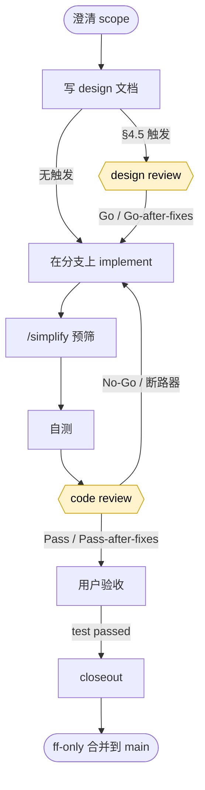

# ccsop

[English](README.md) · **简体中文**

> **Claude Code SOP 框架** —— 一个可安装的 Claude Code 插件，把文档驱动的交付工作流打包，使任何
> 仓库一步即可采用。

ccsop 把在真实项目上打磨出的七大构件捆进单个插件：

1. **交付 SOP**（契约先行、小步推进、未验收不算完成、文档即断点）；
2. **协作协议**（driver + 可插拔 reviewer；design/code/fix 评审框架 9.A–9.E）；
3. **可插拔 review MCP 桥** —— `codex` | `claude` | `manual`；
4. **分级 subagent**（`verify-runner` / `doc-sync` / `deploy-runner`，机械活 = 更省的模型）；
5. **skills**（`/handoff` 启动摘要、`project-sop` 执行地图）；
6. **文档脚手架**（`docs/{records,methodology,plans,design,runbooks,references}` + 任务卡模板）；
7. 显式的**模型分级策略**。

装上插件、跑 `/sop-init`、选一个 review provider，就在工作流下开始交付。

## 快速开始

```text
1. 安装 ccsop             → /plugin marketplace add Gnayj/claude-code-sop ; /plugin install ccsop@gnayj
2. /sop-init                 → 脚手架 docs/ + .codex-review/config.toml + .ccsop/manifest.json
                               （会问：项目名、语言、review provider、translation provider）
3. 配置 provider             → codex: 装桥依赖 (npm install) + Codex 登录
                               claude: export ANTHROPIC_API_KEY
                               manual: 无
4. 写你的第一份 design        → docs/design/<module>/<id>-design.md（从 _template-design.txt）
5. design review（若 §4.5）  → codex_design_review → Go / Go-after-fixes
6. 在分支上 implement         → 一个子项；/simplify 预筛；自测
7. code review               → codex_code_review → Pass / Pass-after-fixes
8. 用户验收                   → 跑 verify 命令，回 "test passed"
9. closeout                  → 单主题 commit + handoff + code-home: ；按 4 确认点 ff-only 合并
```

session 启动时，调 `/handoff` 拿 ~150 行状态摘要，而非全读。

## 安装与首次运行

ccsop 是 Claude Code 插件。发布版的 review 桥**预 build**（其编译后的 `dist/` 已 commit），所以无
TypeScript build 步骤 —— 你只需为桥的运行时依赖跑一次 `npm install`。

**从 marketplace 安装（推荐）。** 在 Claude Code 内：
```text
/plugin marketplace add Gnayj/claude-code-sop
/plugin install ccsop@gnayj
```
ccsop 按 commit SHA 版本化 —— 没有版本号要 bump，所以 `/plugin marketplace update` 总是拉到最新。

**或从 clone 加载**（如固定某版本或改它）：
```bash
git clone https://github.com/Gnayj/claude-code-sop /path/to/ccsop
cd /your/repo && claude --plugin-dir /path/to/ccsop
```

无论哪种，插件命令都在插件下**带命名空间**，如 `/ccsop:sop-init`。

**首次运行顺序。** review 桥读 `/sop-init` 写的 config，所以按此顺序跑：
1. `/ccsop:sop-init` —— 脚手架 `docs/`、`.codex-review/config.toml`、`.ccsop/manifest.json`，并提议装
   桥的运行时依赖（在 `mcp/codex-review/` 里 `npm install` —— 无 build，因 `dist/` 已 ship）。它
   **只加文件** —— 已有的会跳过、不 commit、不带 `--force` 不覆盖 —— 所以在已有仓库里采用是安全的。
2. `/sop-init` 后跑一次 `/reload-plugins`（或重启），让桥拿到新 config。config 存在前，`ccsop-review`
   server 保持已连接但 idle，只提示你跑 `/sop-init` —— setup 完成前不做 review 工作。

**Provider 仅在 review 时才需要。** 脚手架（`/sop-init`）不需 provider。准备 review 时再配一个：
`codex`（Codex 登录）、`claude`（`ANTHROPIC_API_KEY` —— Console 计费，独立于 Pro/Max plan）、或
`manual`（无）。见下表。

## 选 review provider

| Provider | 是什么 | 优点 | 缺点 / caveat |
|---|---|---|---|
| `codex`（默认） | 经 Codex SDK review | **跨模型异构** —— 独立模型抓到 driver 自己模型看不见的盲区；这是已验证路径 | 需 Node + `@openai/codex-sdk` + Codex 登录 |
| `claude` | 经 Anthropic SDK review | 无第二家厂商；任何有 `ANTHROPIC_API_KEY` 的地方都能跑 | **丢失跨模型异构** —— fresh 对抗实例部分补偿但不等价；已注明，不等同 codex |
| `manual` | 写 prompt、贴回 verdict | 零依赖；人 / 外部 reviewer | 两阶段（prepare → submit）；你提供 verdict |

切 provider 是 `.codex-review/config.toml` 里 `review.provider` 一行改动（切换作废旧 session ——
无跨 provider thread 复用）。

## 工作流一览



两个黄色节点是 reviewer 闸门：reviewer **只读**运行（无网络、无写），driver 机械执行 verdict，只在
断路器或 `No-Go` 时叫你。最终合并过 **4 确认点**（push feature → merge → push main → 删远端）。
完整流程、失败模式、回滚 playbook：`docs/methodology/workflow-overview.md`。

## 命令与 skills

- `/sop-init` —— 首次脚手架向导。
- `/sop-update` —— 拉 ccsop-owned 文档更新（冲突安全；绝不碰你的 `records/current.md`）。
- `/sop-lang <lang>` —— 用另一种语言重新物化文档（翻译一次，机器稳定面保留）。
- `/handoff` —— session 启动 / 切任务的结构化项目状态。
- `project-sop` —— 指向方法论文档的执行地图。

## 布局

```
ccsop/
├─ .claude-plugin/plugin.json        插件 manifest（commands/agents/skills/mcpServers）
├─ commands/                          /sop-init · /sop-update · /sop-lang
├─ agents/                            verify-runner · doc-sync · deploy-runner（sonnet 档）
├─ skills/                            handoff · project-sop
├─ mcp/codex-review/                  可插拔 review 桥（ReviewProvider 抽象）
├─ templates/                         docs-scaffold/（canonical EN）+ config.toml.tpl + review-prompts/
└─ docs/design/ccsop-framework/       框架自己的 design 文档
```

## License

[MIT](LICENSE).
