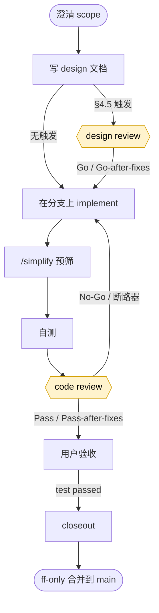

# ccsop

[English](README.md) · **简体中文** · [Deutsch](README.de-DE.md)

> **Claude Code SOP 框架** —— 一个可安装的 Claude Code 插件，把文档驱动的交付工作流打包，使任何
> 仓库一步即可采用。

ccsop 把在真实项目上打磨出的七大构件捆进单个插件：

1. **交付 SOP**（契约先行、小步推进、未验收不算完成、文档即断点）；
2. **协作协议**（driver + 可插拔 reviewer；design/code/fix 评审框架 9.A–9.E）；
3. **可插拔 review MCP 桥** —— `codex` | `claude` | `manual`；
4. **分级 subagent**（`verify-runner` / `doc-sync` / `deploy-runner`，机械活 = 更省的模型）；
5. **skills**（`/handoff` 启动摘要、`project-sop` 执行地图）；
6. **文档脚手架**（`docs/{records,methodology,plans,design,runbooks,references}` + 任务卡模板）；
7. 显式的**模型分级策略**。

装上插件、跑 `/ccsop:sop-init`、选一个 review provider，就在工作流下开始交付。

## 快速开始

```text
1. 安装 ccsop             → /plugin marketplace add Gnayj/claude-code-sop ; /plugin install ccsop@gnayj
2. reload + /ccsop:sop-init  → 脚手架 docs/ + .codex-review/config.toml + .ccsop/manifest.json
                               （会问：项目名、语言、review provider、translation provider）
3. 配置 provider             → codex: 可解析 Codex CLI（config path / package / PATH）+ 已登录
                               claude: Claude CLI 已登录或设置 ANTHROPIC_API_KEY
                               manual: 无
4. 写你的第一份 design        → docs/design/<module>/<id>-design.md（从 _template-design.txt）
5. design review（若 §4.5）  → codex_design_review → Go / Go-after-fixes
6. 在分支上 implement         → 一个子项；/simplify 预筛；自测
7. code review               → codex_code_review → Pass / Pass-after-fixes
8. 用户验收                   → 跑 verify 命令，回 "test passed"
9. closeout                  → 单主题 commit + handoff + code-home: ；按 4 确认点 ff-only 合并
```

session 启动时，调 `/handoff` 拿 ~150 行状态摘要，而非全读。

## 安装、升级与首次运行

### 从哪里安装

当前 ccsop 发布版的受支持安装入口是 **Claude Code plugin marketplace**。一次安装同时服务两个
宿主：

- Claude Code 加载插件命令及其 `ccsop-review` MCP server；
- `/ccsop:sop-init` 或 `/ccsop:sop-update` 物化项目文件。所选 flow 涉及 Codex 或明确请求
  Codex scaffold 时，`/ccsop:sop-init` 才会在 host/migration gate 通过后物化
  `.agents/skills/` 下的五个 repo-local Codex skills；`/ccsop:sop-update` 只在 Codex-owner
  flow、存在 legacy tree 或 canonical tree 已物化时维护/迁移这些 skills；最后一种条件绝不
  新建缺失的 tree；
- Codex CLI 在新 session 中消费这些项目 skills。当前发布版并未打包成 universal
  `.codex-plugin`，因此不要再用 `codex plugin add` 安装第二份。

发布版 review 桥是**预 build 的自包含 JavaScript bundle**。无需 TypeScript build；已有兼容且已登录
的 Codex CLI 时，也无需 `npm install`。只有完全找不到 Codex binary 时，setup/update 命令才会提供
package fallback。运行 bundled MCP server 仍需要 Node.js。

### 全新安装

在 Claude Code 内：

```text
/plugin marketplace add Gnayj/claude-code-sop
/plugin install ccsop@gnayj
/reload-plugins
/ccsop:sop-init
/reload-plugins
```

第一次 reload 激活刚安装的插件命令。随后 `/ccsop:sop-init` 脚手架
`docs/`、`.codex-review/config.toml`、`.ccsop/manifest.json` 和四份 review-prompt seeds。
只有 flow 涉及 Codex 或明确请求时，才会在 host/migration gate 通过后加入 repo-local Codex
skills。命令只添加缺失文件、跳过已有文件、不 commit，且没有 `--force` 时绝不覆盖。最后一次
reload 让插件 MCP server 读取新建的项目 config。

ccsop release 同时带插件版本与不可变 Git tag；marketplace 解析当前 release commit。

### 升级已有安装

用户级安装可在 shell 中运行：

```bash
claude plugin marketplace update gnayj
claude plugin update ccsop@gnayj --scope user
```

在 Claude Code 内的等价命令是：

```text
/plugin marketplace update gnayj
/plugin update ccsop@gnayj
/reload-plugins
```

使用新版命令前，必须重启 Claude Code 或运行 `/reload-plugins`；旧 session 可能仍指向已 orphan
的旧插件 cache。然后在每个已经存在 `.ccsop/manifest.json` 的项目中运行：

```text
/ccsop:sop-update
```

`/ccsop:sop-update` 更新 ccsop-owned 文件及 pristine generated seeds，保留 consumer-owned
或本地修改内容；遇到冲突会报告而不是覆盖。若输出 scoped `/mcp` reconnect 或 restart 指引，
按提示处理。

如果仓库曾用 v0.2.13 以 zh-CN 初始化，可能缺少
`.codex-review/templates/implement.md.tpl` 及对应 manifest entry。升级到 v0.2.14 后，标准的
reload/restart + `/ccsop:sop-update` 会在两者都不存在时以 `new-seed-added` 补齐。如果该路径
已经存在无 provenance 的文件，ccsop 会保留它并报告 provenance conflict，不会覆盖。

最初由 v0.1.0 接入的仓库可能仍使用历史 manifest ID
`review-prompts/<basename>`。在 v0.2.15 中，`/ccsop:sop-update` 只识别
“官方 legacy ID 与 `.codex-review/templates/<basename>` 路径精确对应”的组合，先原子规范为
`templates/review-prompts/<basename>`，再完成标准四 prompt reconciliation。未知、错配、
已退役、重复或碰撞的 provenance 仍然 fail-closed。解除该 guard 时，应核实后把官方 entry
修成精确 canonical ID，或删除 bogus manifest entry 后重跑；只改 `owner` 或选择 keep-local
不能消除 namespace 歧义。

### 验证 Claude Code 与 Codex CLI

1. 运行 `claude plugin list --json`，确认 `ccsop@gnayj` 显示预期的已发布版本。
2. 确认目标仓存在 `.ccsop/manifest.json` 和四份
   `.codex-review/templates/{design-review,code-review,fix-review,implement}.md.tpl`。
3. 按 `/sop-init` 或 `/sop-update` 报告的 Codex-scaffold 分支核对：
   - `claude+claude` 且既没有 legacy skill、也没有既存 canonical tree：
     `.agents/skills` 不存在是预期。明确请求 scaffold 是首次 `/sop-init` 的能力；canonical
     tree 一旦存在，`/sop-update` 会维护它，但不会新建缺失的 tree；
   - flow 涉及 Codex、host gate 通过且无 migration/provenance conflict：应存在
     `.agents/skills/{project-sop,handoff,simplify,sop-flow,sop-tier}/SKILL.md` 和
     `AGENTS.md` 的 ccsop pointer；
   - host gate 未通过或 migration/provenance conflict 未解：应保留原文件和 pointer，并报告
     scoped conflict；不要断言 canonical skills 必须存在。
4. canonical skills 存在时，使用 Codex CLI `>=0.145.0-alpha.2`，在该仓启动一个**新**
   Codex session，并调用 `$handoff`。
5. 若要从 Codex 侧自动 review/调用控制工具，运行 `codex mcp list`，确认同一个
   `ccsop-review` stdio server 已注册且 enabled，并且它的 `--config` 参数指向当前仓的
   `.codex-review/config.toml`。Codex 侧没有针对当前项目正确注册 MCP 时，repo-local skills
   仍会加载，但跨模型 review 需要用户手工 relay。

### 从 clone 加载

若要固定或修改某个 revision，而不是通过 marketplace 安装：

```bash
git clone https://github.com/Gnayj/claude-code-sop /path/to/ccsop
cd /your/repo && claude --plugin-dir /path/to/ccsop
```

**Provider 仅在 review 时才需要。** 脚手架（`/sop-init`）不需 provider。准备 review 时再配一个：
`codex`（兼容 Codex CLI + 已登录）、`claude`（CLI backend 使用已登录 Claude CLI；API backend
使用 `ANTHROPIC_API_KEY`）或 `manual`（无）。插件命令始终带命名空间，例如
`/ccsop:sop-init`。

## 选 review provider

| Provider | 是什么 | 优点 | 缺点 / caveat |
|---|---|---|---|
| `codex`（默认） | 经 bundled Codex provider review | **跨模型异构** —— 独立模型抓到 driver 自己模型看不见的盲区；这是已验证路径 | 需 Node + 兼容且已登录的 Codex CLI，或可选 package fallback |
| `claude` | 经 Claude CLI 或 Anthropic API review | 支持已登录的 CLI subscription 或 API backend | **丢失跨模型异构** —— fresh 对抗实例部分补偿但不等价；需已认证的兼容 CLI 或 API key |
| `manual` | 写 prompt、贴回 verdict | 零依赖；人 / 外部 reviewer | 两阶段（prepare → submit）；你提供 verdict |

切 provider 是 `.codex-review/config.toml` 里 `review.provider` 一行改动（切换作废旧 session ——
无跨 provider thread 复用）。

## 协作流程（谁 design × 谁 implement）

除了选 reviewer，你还可以把**工作本身**在两个模型之间拆分
（`claude-code-sop-collaboration.md §1.D`）。4 个可切换流程，命名
`<design_owner>+<implement_owner>`：

| 流程 | design | design review | implement | code review | 你在哪个 CLI 推 |
|---|---|---|---|---|---|
| `claude+claude`（默认） | claude | codex | claude | codex | Claude Code |
| `claude+codex` | claude | codex | codex | claude | Claude Code |
| `codex+codex` | codex | claude | codex | claude | Codex CLI |
| `codex+claude` | codex | claude | claude | codex | Codex CLI |

- **reviewer 派生、不可配** —— 每个阶段由该阶段 owner 的对侧模型 review，因此每个流程都保住跨模型
  review，self-review 不可表达。
- **你从 design owner 的 CLI 主推。** 拆分流程（`claude+codex` / `codex+claude`）下 implement 段
  （implement → code review → fix → ready-to-test）在 implementer 的 CLI 里对着一张必出的
  implement 任务卡跑完；交接靠 `current.md` + 任务卡。
- **`claude+codex` 加成 —— 主持模式**：该格可以完全不切 CLI。配置 `[implement] enabled = true`
  后，driver 经 `codex_implement` 向 codex 写手派发有界工单：codex 在隔离 scratch 干活，server
  按卡内 ```files 白名单校验结果（任何越界终态改动 ⇒ 整单拒绝、什么都不产出）并返回 **patch
  工件** —— driver 自己 review 后亲手 apply（`git apply --check` → `git apply`）。工具从不写你的
  仓库，也没有任何自动 apply。
- **`codex+claude` 可选 proposal 模式**：Linux + `bwrap`/`prlimit` 且有已认证、版本受支持的
  Claude CLI 时，schema 2 暴露 `claude_implement`。它复用同一 snapshot/capture/allowlist
  transaction，只给 Read/Edit/Write、不给 Bash，并校验 task-card SHA、durable design/daily
  budget、process-group cancellation 与 server 侧断网 validation。默认 `enabled=false`，
  flow 不会自动开启；validation 未配置时只产诚实的 `advisory-only / export-only` 工件。
- **切换**走共享控制面：Claude 主推流用 `/sop-flow`，Codex 主推流用 `$sop-flow`。两者都调用
  schema-valid `ccsop_configure` writer，下一次 bridge 调用即读到新配置，无需 restart。按 session
  口头指定（"这单 codex+claude"）仍是只读 override。schema 1 保持 **manual relay**；
  schema 2 展示真实 Claude proposal adapter 的 enable/validation/apply readiness。
  每次 mutation 会把 preimage 按内容寻址保存到
  `<meta.repo_root>/.ccsop/backups/config/<sha256>.toml`。这些是 operator-retained 恢复数据
  （不会自动过期）；保持 `.ccsop/backups/` 不提交，并只按本仓 retention policy 清理旧条目。
- flow 涉及 Codex（或明确请求）时，`/sop-init` 会在 host/migration gate 通过后于 canonical
  `.agents/skills/` 下铺五个 repo-local Codex skills：
  `$project-sop`、`$handoff`、`$simplify`、`$sop-flow`、`$sop-tier`。最低要求 Codex CLI
  `>=0.145.0-alpha.2`。`/sop-update` 只迁移 provenance 证明 pristine 的 legacy
  `.codex/skills/project-sop`；modified / unknown / divergent 均保留并报 conflict。可验证的精确
  迁移可用 `/sop-update --rollback-codex-skills` 回滚。

## 工作流一览


```mermaid
flowchart TD
    A([澄清 scope]) --> B[写 design 文档]
    B -->|"§4.5 触发"| DR{{design review}}
    B -->|无触发| I[在分支上 implement]
    DR -->|"Go / Go-after-fixes"| I
    I --> S["/simplify 预筛"]
    S --> T[自测]
    T --> CR{{code review}}
    CR -->|"Pass / Pass-after-fixes"| V[用户验收]
    CR -->|"No-Go / 断路器"| I
    V -->|"test passed"| C[closeout]
    C --> M([ff-only 合并到 main])

    classDef review fill:#fff3cd,stroke:#d39e00,color:#000;
    class DR,CR review;
```

两个黄色节点是 reviewer 闸门：reviewer **只读**运行（无网络、无写），driver 机械执行 verdict，只在
断路器或 `No-Go` 时叫你。最终合并过 **4 确认点**（push feature → merge → push main → 删远端）。
完整流程、失败模式、回滚 playbook：`docs/methodology/workflow-overview.md`。

## 执行框架 —— 为什么有效、最佳实践、注意点

**你得到什么。** 一个单一闭环 —— *契约 → design → review → implement → review → test → closeout → 合并*
—— 每一步都落进文档，使工作可冷启动恢复、不重新推导。具体：

- **契约先行、小步推进**：编码前锁定行为契约 + 验收；每轮一个可验证子项（未验收不算完成）。
- **独立、可插拔的 review**：design/code/fix review 由独立模型做 —— `codex`（默认）给跨模型异构、抓你自己
  模型的盲区；`claude` / `manual` 也行。
- **文档即断点**：`current.md` + 任务卡 + `code-home:` 留下几个月后可恢复的痕迹。
- **模型分级**：判断用强模型，机械 agent 用更省的档（`model-tier-strategy.md`）。
- **自治档位**（config 里 `[collaboration] autonomy`）：跑 **`gated`**（你确认每道闸）或 **`full-auto`** ——
  driver 跑完整循环、只在某个决定确实该你拍时才停，最后出一份 run 报告。
- **流程矩阵**（config 里 `[collaboration] design_owner / implement_owner`）：把 design 和 implement 在两个
  模型间拆分（4 个流程，见上文"协作流程"）—— 对侧恒 review，你从 design owner 的 CLI 主推。
- **消费者扩展块**：把项目自有内容放进 ccsop 托管的 Markdown 文档里
  （`<!-- consumer:begin <slug> anchor="<章节号>" -->` … `<!-- consumer:end <slug> -->`）——`/sop-update`
  绕着它重渲染，框架更新与你的扩展共存；纯译文修订现在也能送达翻译仓（`translation_source_sha`）。

**最佳实践。**

- 先 **`gated`**；对验收可机器验的良定义工作再升到 **`full-auto`**。
- 对**品味/风格重**或**大批量**工作，先取一份**抽样 checkpoint** 再批量产出 —— full-auto 内建这条，使它不会
  在规模上"高效地跑偏"。
- 让 **reviewer** 裁技术分叉；把你的注意力留给 偏好/业务/验收 类判断。
- 让 `current.md` 当当前状态的单一真源；session 启动调 `/handoff`。

**注意点。**

- `full-auto` **绝不**自动做 破坏性/生产/不可逆 动作、**绝不** push 私→公或推任何远端、**绝不**自动发布/部署
  —— 这些永远升级给你。
- 对主观质量或真实环境行为，**自验 ≠ 你的验收**；full-auto 会升级这些（它只自验机器可验的闸）。
- 若某个所需检查**跑不了**（缺 key / 权限 / 工具），full-auto **停下**，而非声称它过了。

见 `docs/methodology/claude-code-sop-collaboration.md` §1.A–§1.C（自治档位 + 升级谓词 + 自验边界）和
`workflow-overview.md` 看完整流程。

## 命令与 skills

- `/sop-init` —— 首次脚手架向导。
- `/sop-flow` —— 通过 `ccsop_configure` 查看或切换 Claude 主推 standing flow。
- `/sop-tier` —— 通过 `ccsop_configure` 查看或设置已被消费的 reviewer/Codex-dispatch 档位。
- `/sop-update` —— 拉 ccsop-owned 文档更新（冲突安全；绝不碰你的 `records/current.md`）。
- `/sop-lang <lang>` —— 用另一种语言重新物化文档（翻译一次，机器稳定面保留）。
- Claude `/handoff` —— session 启动 / 切任务的结构化项目状态。
- Codex `$project-sop`、`$handoff`、`$simplify`、`$sop-flow`、`$sop-tier` —— canonical
  `.agents/skills/` 执行与控制 UX。

## 布局

```
ccsop/
├─ .claude-plugin/plugin.json        插件 manifest（commands/agents/skills/mcpServers）
├─ commands/                          /sop-init · /sop-flow · /sop-tier · /sop-update · /sop-lang
├─ agents/                            verify-runner · doc-sync · deploy-runner（sonnet 档）
├─ skills/                            handoff · project-sop
├─ mcp/codex-review/                  可插拔 review 桥（ReviewProvider 抽象）
├─ templates/                         docs-scaffold/（canonical EN）+ config.toml.tpl + review-prompts/
└─ docs/design/ccsop-framework/       框架自己的 design 文档
```

## License

[MIT](LICENSE).
